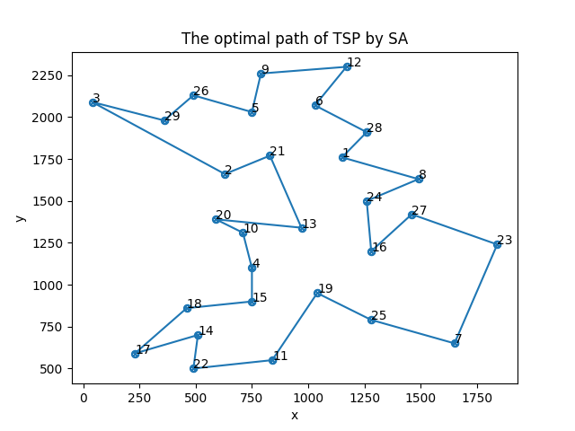
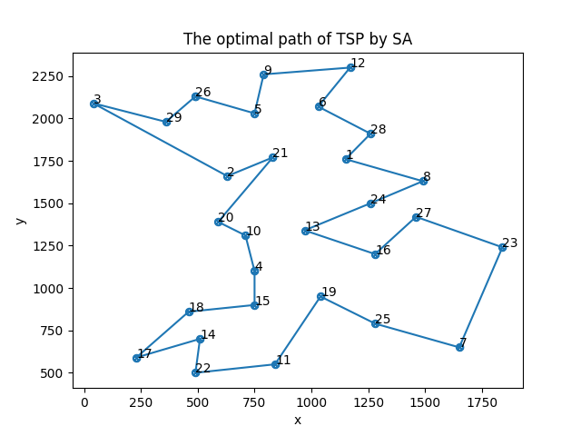
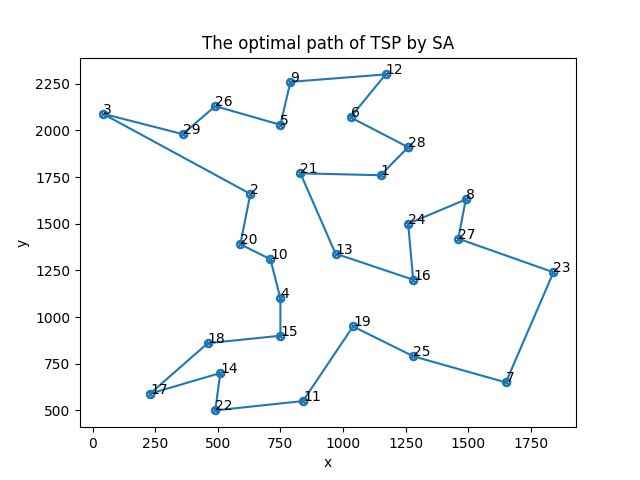

# 模拟退火解决TSP问题
## 问题分析
SA算法源于对固体退火过程的模拟，采用Metropolis接受准则，并用一组称为冷却表的参数控制算法进程，使算法在有限时间里给出一个近似最优解。因此算法的主要流程为：
- 设计冷却进度表，包括初始温度，终止温度，温度衰减系数，Markov链长度
- 设计初始路径，计算初始路径的总长度
- 进行模拟退火的流程，得到结果
## 结果测试
多次运行程序得到多组结果：

结果1：[28, 1, 8, 24, 16, 27, 23, 7, 25, 19, 11, 22, 14, 17, 18, 15, 4, 10, 20, 13, 21, 2, 3, 29, 26, 5, 9, 12, 6] 总距离：2028

结果2:[15, 18, 17, 14, 22, 11, 19, 25, 7, 23, 27, 8, 28, 6, 12, 9, 5, 26, 29, 3, 2, 21, 1, 24, 16, 13, 10, 20, 4] 总距离：2034

结果3:[26, 5, 9, 12, 6, 28, 1, 8, 24, 13, 16, 27, 23, 7, 25, 19, 11, 22, 14, 17, 18, 15, 4, 10, 20, 21, 2, 3, 29] 总距离：2026

结果4:[28, 6, 12, 9, 5, 26, 29, 3, 2, 20, 10, 4, 15, 18, 17, 14, 22, 11, 19, 25, 7, 23, 27, 8, 24, 16, 13, 21, 1] 总距离：2020 **(bays29最优解)**

> 如有谬误，敬请指正