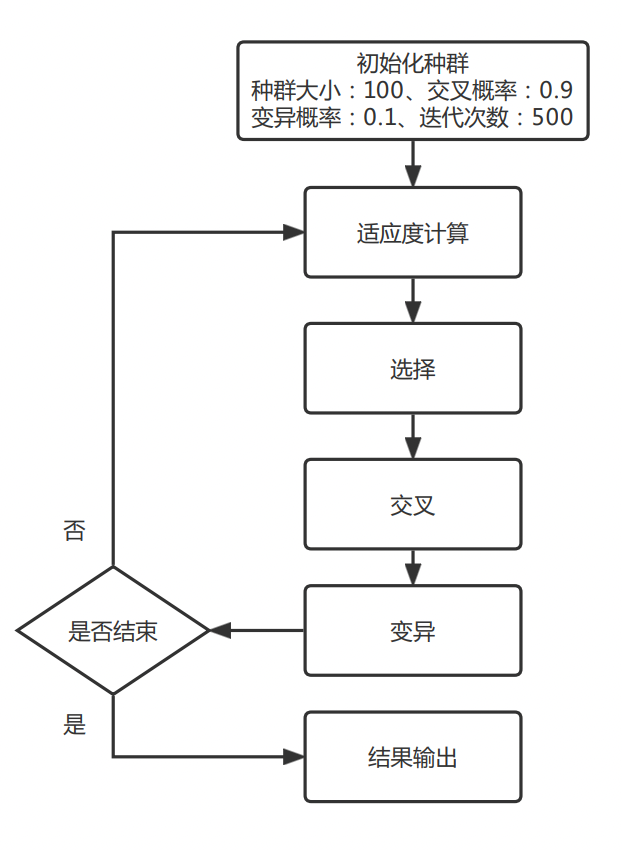
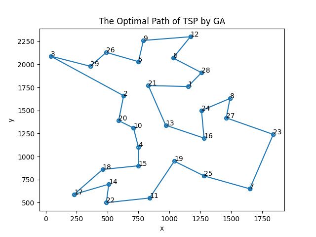
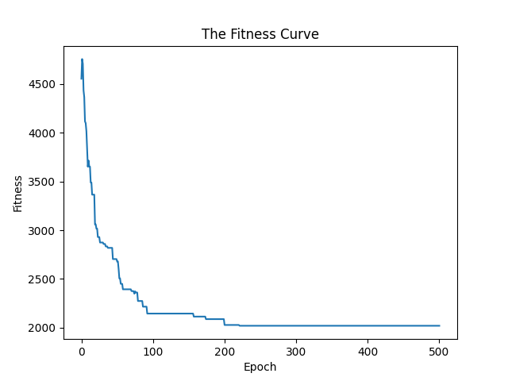

# 模拟进化计算/遗传算法（GA）解决TSP问题
## 实现步骤
根据上述分析，这里使用Python语言进行算法实现，其详细步骤如下。

（1）数据读取load_data（复用实验2）

根据前文数据分析，需要将距离矩阵以及坐标矩阵读取，首先是距离矩阵的读取，位于bays29.tsp文件的9～37行，利用Python的文件读取功能open函数，定位到该位置，逐行读取，由于读取后有众多的空格以及换行符，这里配合使用filter函数以及lambda表达式进行筛除。三个关键操作为：利用strip()去除空格以及利用split按空格切分成列表、利用filter和lambda去除列表中的空格、利用map将字符串转为浮点数。

（2）路径图绘制函数draw_map

参数输入为坐标数据以及一条路径，利用matplotlib绘制一条回路的折线图，并且标记好每个城市的标号。

（3）适应度曲线draw_fitness
参数输入为一代种群中最优个体的适应度列表，即每一代产生的最短路径，绘制曲线图。

（4）适应度函数get_path_distance
在TSP问题中，将每个个体的路径总长作为个体的适应度，路径越短则适应度越强。所以将路径对应的城市间距离求和（需加上起点终点的距离）作为个体的适应度。

（5）初始化种群函数init_population
种群的的初始化，利用random.sample循环产生种群大小（100）的初始种群。

（6）Grefenstette编码与解码
在基因的交叉、变异中由于会对基因型进行改变，因而会产生不合法的染色体，即在TSP问题中可能发生一个城市多次出现的情况，产生无效路径，而Grefenstette编码与解码可以有效避免这一情况。其原理如下：

W = (A  B  C  D  E  F  G  H  I  J)

path1 = (A  D  B  H  F  I  J  G  E  C)

path2 = (B  C  A  D  E  J  H  I  F  G)

则编码后如下：

path1_encode = (1  3  1  5  3  4  4  3  2  1)

path2_encode = (2  2  1  1  1  5  3  3  1  1)

（7）选择函数select

遗传算法中选择算子的选择有很多种类，如轮盘赌、随机遍历、锦标赛等，这里采用锦标赛算法实现选择操作，先shuffle置乱种群，对于种群中的每个个体，使用random.choice循环随机抽取20个个体作为一组，进行竞赛，即适应度的比较，前五名为胜者，可进行交叉和变异等进化操作。循环20轮，选出100个个体。

（8）交叉函数crossover

先对7所得种群做一次置乱，保证交叉的随机性，然后对种群进行Grefenstette编码，对编码后的种群进行遍历，对于每一个个体以及与其相邻的个体作为父代，当交叉概率大于产生的随机概率时，做交叉操作产生两个新个体，待遍历完成再做一轮解码操作。交叉操作首先产生两个随机数作为边界，边界之间的基因片段不变，交换两端的基因片段。

如6中例子，假设选定的边界为3和6

path1_encode = (1  3  1  **5  3  4  4**  3  2  1)

path2_encode = (2  2  1  **1  1  5  3**  3  1  1)

交叉后

new_gen1 = (**2  2  1**  5  3  4  4  **3  1  1**)

new_gen2 = (**1  3  1**  1  1  5  3  **3  2  1**)

（9）变异函数mutation

遍历8所得的种群，对于每个个体，如果变异概率大于产生的随机概率，则做一次变异操作。变异操作中，随机产生两个随机边界值，边界之间的片段做一次倒位变异，以path1为例，假设边界为3和6：

path1_encode = (1  3  1  **5  3  4  4**  3  2  1)

变异后：

new_gen1 = (1  3  1  **4  4  3  5**  3  2  1)

（10）遗传算法GA

首先进行参数设置，种群空间大小设置为100，交叉概率0.9，变异概率0.1，最大迭代次数500。首先导入城市数据，然后初始化种群，接着迭代500次，进行选择、交叉、变异操作，记录每一轮的最优个体以及对应的距离，最后找到搜索到的最优的路径和最短距离。


## 结果测试
具体结果见```./imgs/GA*.png```，这里仅展示一组找到的最优解：


