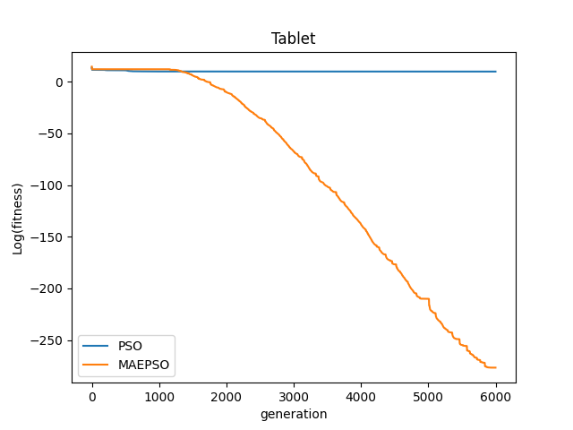
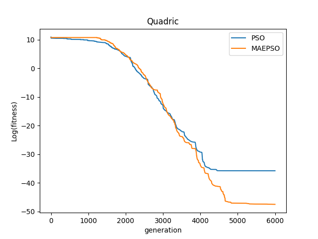
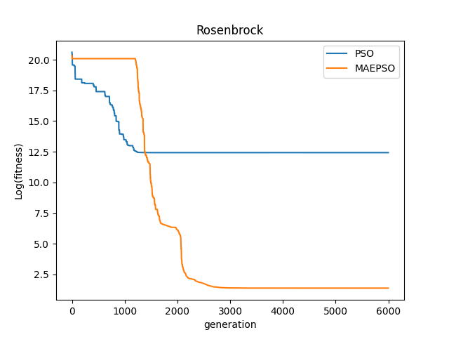
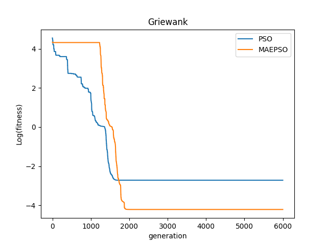
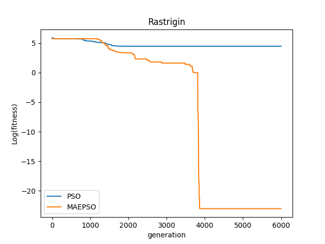
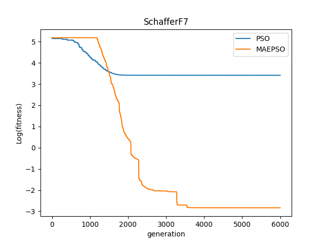

# 粒子群优化算法（PSO） & 多尺度粒子群优化算法（MAEPSO）
## PSO
（1）参数设置，初始化种群，初始化并且维护两个最优位置，即个体所经历过的最优位置pbest和全局经历过的最优位置gbest

（2）计算粒子群适应度

更新粒子速度，更新的公式如下：
$$v_{i d}(t+1)=w \times v_{i d}(t)+c_1 \times r_1 \times\left(p_{i d}(t)-x_{i d}(t)\right)+c_2 \times r_2 \times\left(p_{g d}(t)-x_{i d}(t)\right)$$
其中w为惯性权重因子，其随着迭代过程线性递减，r1，r2为两个0-1之间的随机数，c1和c2为学习因子。pid为个体最优位置，pgd为全局最优位置。速度限定在Vmax范围内。

（4）更新位置，位置限定在搜索空间内，公式为：
$$x_{i d}(t+1)=x_{i d}(t)+v_{i d}(t+1)$$

（5）新最优位置，个体最优位置更新为自己所经历的适应度最小的位置，全局最优位置更新为当前个体最优位置中最优的（适应度最小的）个体。

（6）惯性因子更新，线性下降，wmax为最大惯性因子，wmin为最小惯性因子，gene为当前代数，generation为总代数，公式如下：
$$w=w_{max}-(w_{max}-w_{min})*gene/generation$$
（7）个体进化，搜索最优
## MAEPSO
论文提出的MAEPSO算法步骤如下：

（1）参数设置，初始化种群，初始化并且维护两个最优位置，即个体所经历过的最优位置pbest和全局经历过的最优位置gbest

（2）计算粒子群适应度，速度更新，更新公式与1中步骤（3）一致，对于更新后的速度如果小于速度阈值的话需要进行逃逸操作。具体规则见论文。

（4）每完成一次逃逸运动，该位置的逃逸次数自增，然后更新粒子位置，更新个体和全局最优位置。

（5）多尺度算子的更新，将种群中的所有个体划分为M个，子群粒子个数为P=N/M，其中N为种群大小。然后计算每个子群的平均适应度，更新每个变异算子的标准差，第m个变异算子的标准差为：

$$\sigma_m^{(K-1)} \exp \left(\frac{M \cdot F i t X_m^{(K)}-\sum_{m=1}^M F i t X_m^{(K)}}{F i t X_{\max }-F i t X_{\min }}\right)$$

其中：
$${ Fit } X_{\max }=\max \left(F i t X_1^{(K)}, F i t X_2^{(K)}, \ldots, F i t X_M^{(K)}\right)$$

$$F i t X_{\min }=\min \left(F i t X_1^{(K)}, F i t X_2^{(K)}, \ldots, F i t X_M^{(K)}\right)$$

（6）同时，对于变异算子标准差需要做出如下规定，当变异算子标准差大于W/4时，W为搜索空间，做如下改变：
$$\sigma_i^{(k)}=\left|W / 4-\sigma_i^{(k)}\right| $$

（7）更新速度阈值，对与大于k1（k1=5）的G中元素（逃逸次数），将其置0，同时速度阈值除以k2（k2=10）。

（8）更新惯性因子，线性递减，与1中（6）方法一致。

（9）粒子群进化，搜索最优
## 结果测试
Tablet函数：

Quadric函数：

Rosenbrock函数：

Griewank函数：

Rastrigin函数：

SchafferF7函数： 

> 如有谬误，敬请指正！