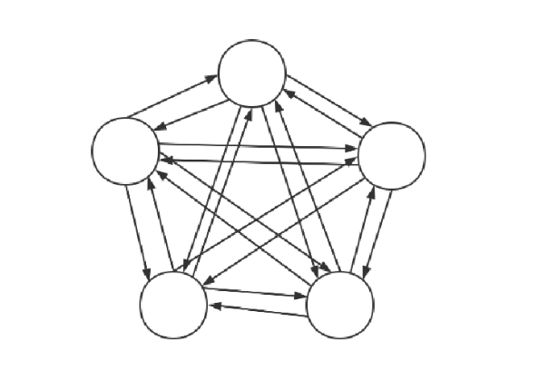

# 人工神经网络解决TSP问题
## 问题分析
Hopfield神经网络是一种比较特殊的网络，它不像一般的神经网络那样有输入层和输出层，并且通过训练来改变神经网络中的参数，最终实现预测、识别等功能。Hopfield网络只有一群神经元节点，所有节点之间相互连接。

Hopfield神经网络主要有两个应用：一是储存器，当我们把多个序列或图片输入这个网络，最终网络会以神经元之间连接权重的形式储存这些信息，当我们再次往这个网络输入相同或有些破损部分的原来的一个输入序列/图像，它能够把序列/图像还原。二是求解TSP问题，搜索TSP问题中的最优解。本次实验将实现连续行的Hopfield网络来求解TSP问题。连续型Hopfield网络的计算步骤如下：

1.随机初始化电压矩阵U(t)，每个随机数在0附近

2.计算一个换位矩阵
$$V_{x i}(t)=\frac{1}{2}\left(1+\tanh \left(\frac{U_{x i}(t)}{U_0}\right)\right)$$

3.计算dU/dt

$$ \frac{d U_{x i}}{d t}=-A\left(\sum_{j=1}^n V_{x, j}-1\right)-A\left(\sum_{y=1}^n V_{y, i}-1\right)-D\left(\sum_{y=1}^n d_{x y} V_{y, i+1}\right)$$

4.计算U(t+1)
$$ U_{x, i}(t+1)=U_{x, i}(t)+\frac{d U_{x, i}}{d t} \Delta t $$

5.计算能量

$$ E=\frac{A}{2} \sum_{x=1}^n\left(\sum_{i=1}^n V_{x, i}-1\right)^2+\frac{A}{2} \sum_{i=1}^n\left(\sum_{x=1}^n V_{x, i}-1\right)^2+\frac{D}{2} \sum_{x=1}^n \sum_{y=1}^n \sum_{i=1}^n V_{x, i} d_{x, y} V_{x, i} V_{y, i+1} $$

6.转到步骤2重复迭代，得到最终的换位矩阵V

## 结果测试
见[人工神经网络测试结果](../imgs/人工神经网络测试结果/)
> 如有谬误，敬请指正！